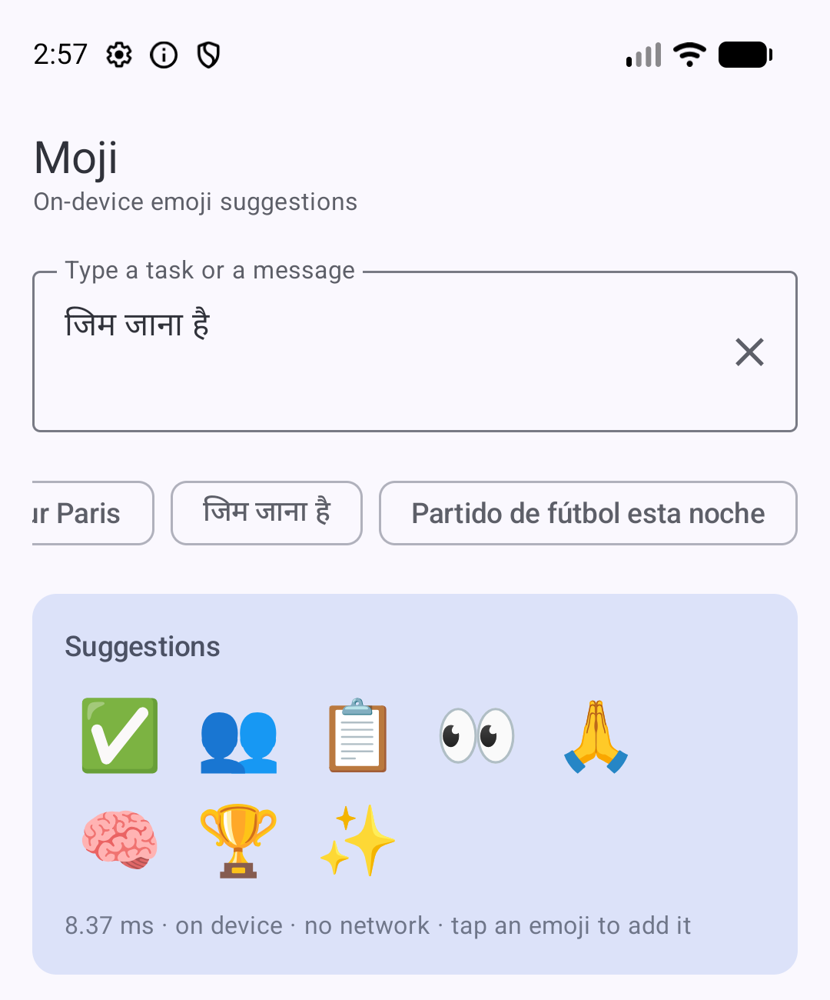
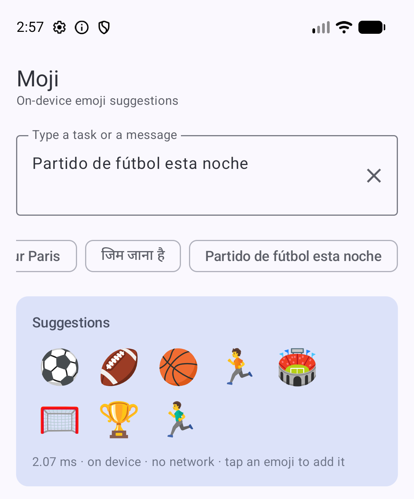
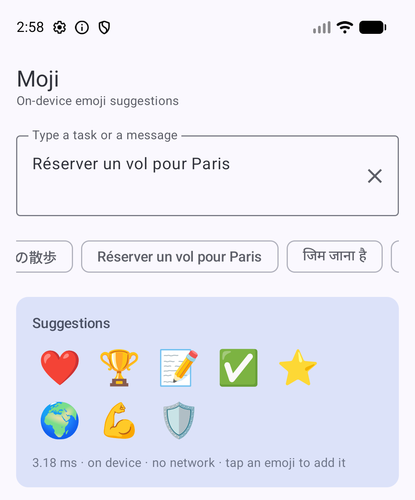

# Moji 🙂

By Hoverfly. On-device emoji suggestions for Android. You give it a task or a message and get back the emoji that fit, in 22+ languages.

```kotlin
import io.github.rajumark.hoverfly.moji.Moji

Moji(context).use { moji ->
    moji.suggestions("Pay my bills")   // 💰 💸 🧾 💵 💳 …
}
```

- **No dependencies.** Inference is plain Kotlin. There is no ONNX Runtime, TFLite or native code, so the library adds about 5 MB to an APK.
- **Private and offline.** The model ships inside the AAR. There is no network, no permission and no telemetry.
- **Fast.** About 0.5 ms per suggestion once warm (emulator on Apple silicon) and about 2 ms on a mid-range phone (Moto G57 Power).
- **minSdk 21.** Works from Kotlin and Java.

## Install

Available via [JitPack](https://jitpack.io/#rajumark/moji):

```kotlin
// settings.gradle.kts
dependencyResolutionManagement {
    repositories {
        mavenCentral()
        maven { url = uri("https://jitpack.io") }
    }
}

// build.gradle.kts
dependencies {
    implementation("com.github.rajumark:moji:v1.0.0")
}
```

## Screenshots

Same model, same device, three languages — suggestions run entirely on-device, no network round trip.

| Hindi | Spanish | French |
|---|---|---|
|  |  |  |
| "जिम जाना है" | "Partido de fútbol esta noche" | "Réserver un vol pour Paris" |

## Use

```kotlin
import io.github.rajumark.hoverfly.moji.Moji
import io.github.rajumark.hoverfly.moji.SkinTone

val moji = Moji(context)               // loads the model: ~50–200 ms, do it off the main thread, keep one instance

val top = moji.suggestions("Pay my bills")
top.first().emoji                      // "💰"
top.first().name                       // "money bag"
top.first().confidence                 // 0.36

moji.suggestions("Great job thumbs up", limit = 5, skinTone = SkinTone.MEDIUM)   // 👍🏽 👏🏽 …

moji.close()                           // frees the model's heap memory
```

`suggestions()` is thread-safe and fast enough to call on every keystroke.

With coroutines:

```kotlin
val moji = withContext(Dispatchers.Default) { Moji(context) }
```

From Java:

```java
try (Moji moji = new Moji(context)) {
    List<MojiSuggestion> s = moji.suggestions("Pay my bills");
}
```

### API

| | |
|---|---|
| `Moji(context)` | Loads the bundled model. `Closeable`. |
| `suggestions(text, limit = 8, skinTone = null)` | The best emoji first. Returns `List<MojiSuggestion>`. |
| `MojiSuggestion(emoji, name, confidence, supportsSkinTone)` | One result. |
| `SkinTone.LIGHT … DARK` | Applied to the people and hand emoji that support it. `applyTo(emoji)` is also public. |

## Sample app

`sample/` is a Jetpack Compose (Material 3) demo: live suggestions as you type, tap-to-insert, skin tones and a confidence view.

```bash
./gradlew :sample:installDebug
```

## Project layout

```
moji/                 the library (AAR)
  src/main/assets/moji/   moji.bin (int8 weights) · spm_pieces.tsv (tokenizer) · vocab.tsv (1000 emoji)
  src/main/kotlin/io/github/rajumark/hoverfly/moji/          public API: Moji, MojiSuggestion, SkinTone
  src/main/kotlin/io/github/rajumark/hoverfly/moji/internal/ Featurizer, SentencePiece, Network (the model in plain Kotlin)
  src/test/           JVM tests: parity with Python on 443 vectors, API, latency
  src/androidTest/    the same parity check on a real device (Android ICU)
sample/               demo app
```

## Tests

```bash
./gradlew :moji:testDebugUnitTest                        # JVM: parity + API
./gradlew :moji:connectedDebugAndroidTest                # on a connected device/emulator
./gradlew :moji:connectedReleaseAndroidTest -PtestBuildType=release   # realistic device latency
```

The parity tests require identical featurizer ids and an identical top-5 to the Python reference on all 443 vectors (tasks, 22 languages and edge cases). Probabilities match to within 1e-4; the current maximum difference is 3e-6.

## Updating the model

The assets come from the training repo (`personal_project/moji`):

```bash
cd ../../moji
.venv/bin/python scripts/export_kotlin.py --run runs/moji_v3
```

This rewrites `moji/src/main/assets/moji/*` and `moji/src/test/resources/testvectors.tsv`. Run the tests, then bump `VERSION_NAME`.

## Publishing

See [PUBLISHING.md](PUBLISHING.md).

## License

Code and model: Apache-2.0. Training-data attributions are in [NOTICE](NOTICE).
