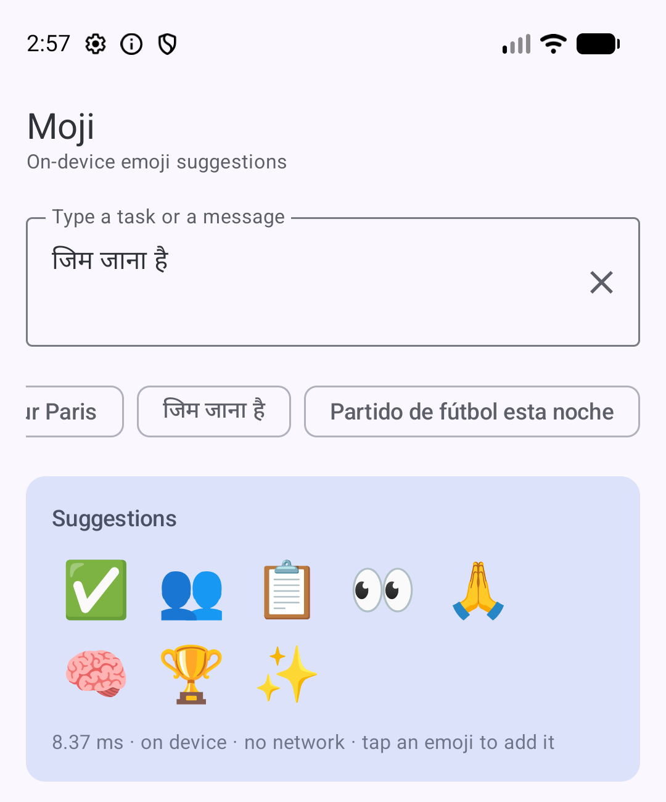
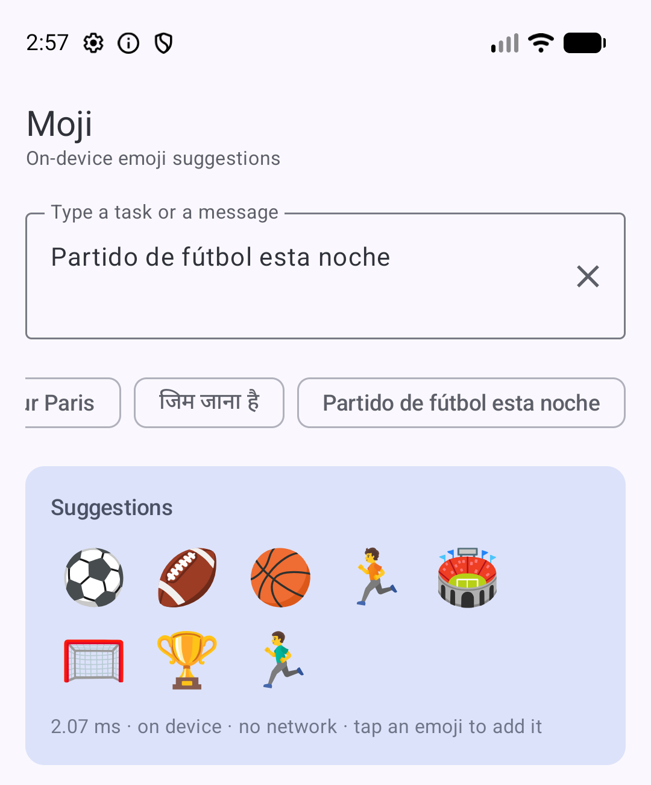
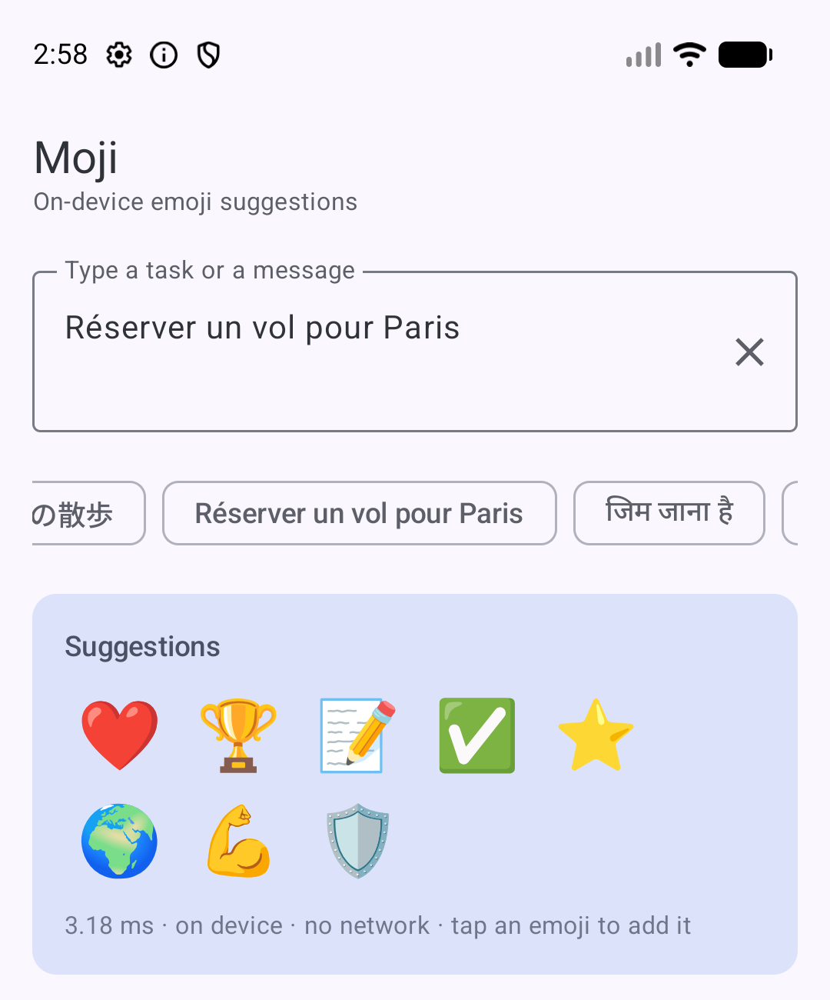
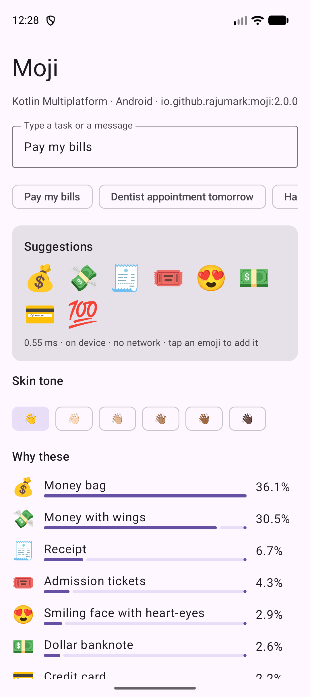
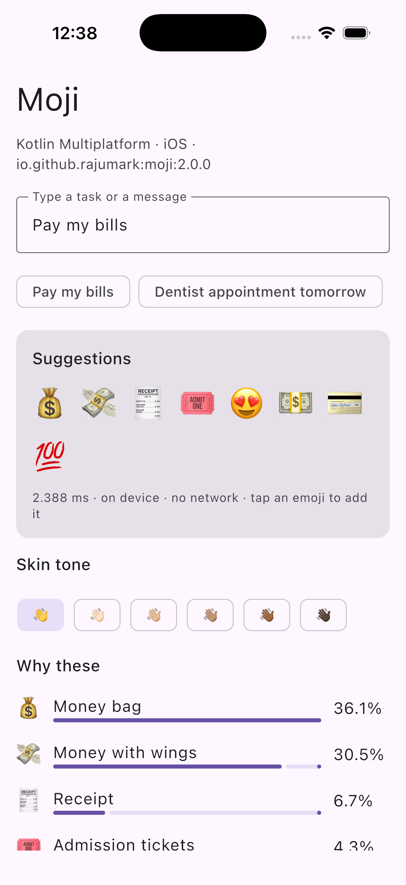
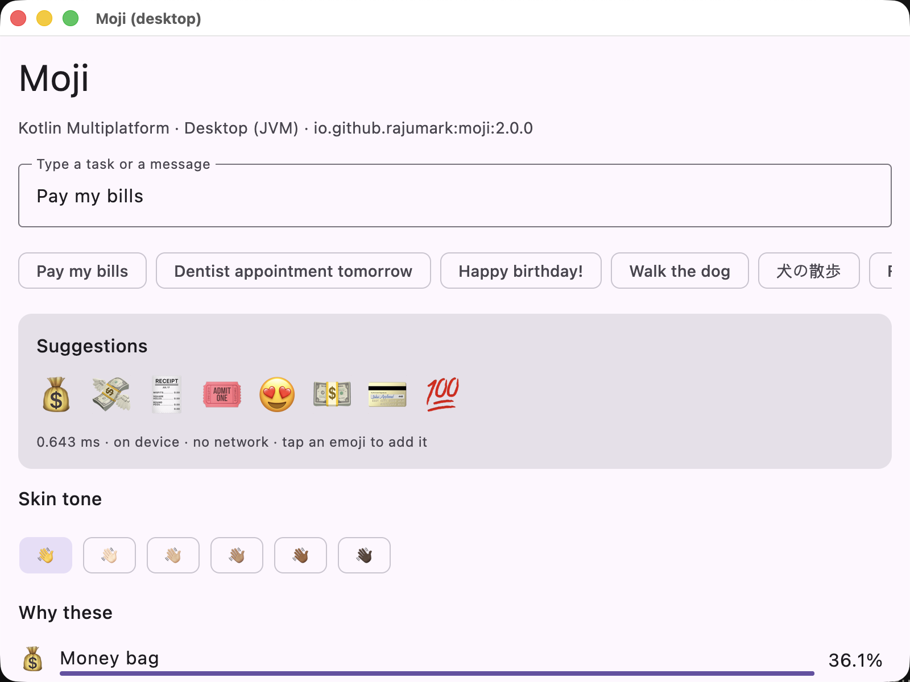
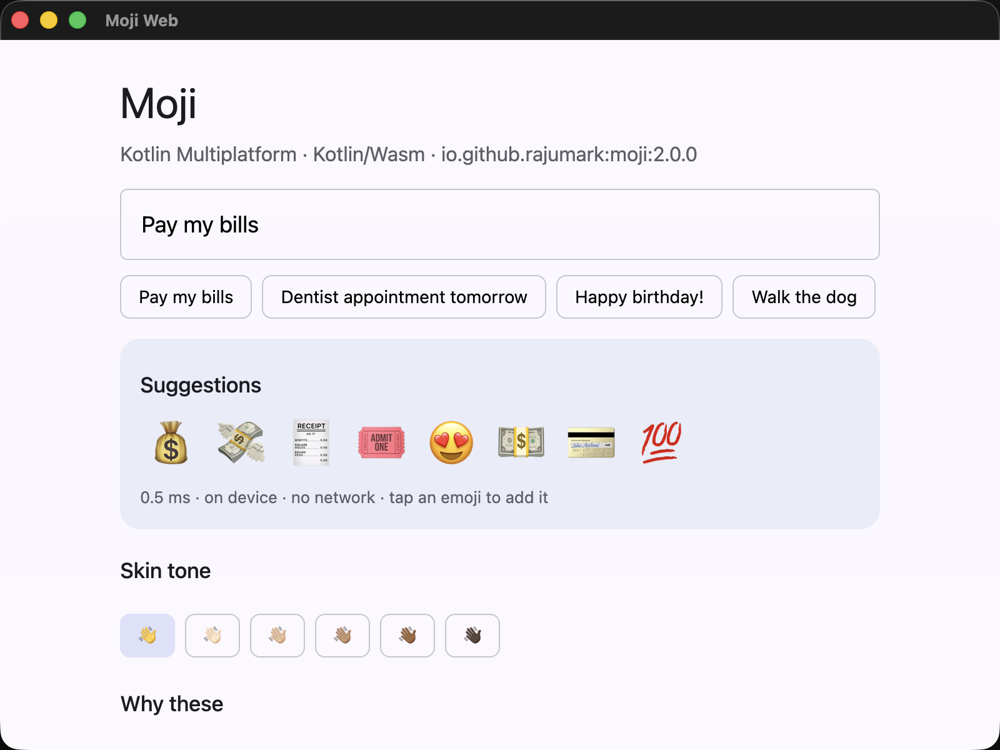

# Moji 🙂

By Hoverfly. On-device emoji suggestions for **Kotlin Multiplatform**: Android, iOS, macOS, JVM desktop, JavaScript and WebAssembly. You give it a task or a message and get back the emoji that fit, in 22+ languages.

```kotlin
import io.github.rajumark.hoverfly.moji.Moji

Moji().use { moji ->
    moji.suggestions("Pay my bills")   // 💰 💸 🧾 💵 💳 …
}
```

- **No dependencies.** Inference is plain Kotlin in common code. There is no ONNX Runtime, TFLite or native code, and the library adds about 5 MB to an app.
- **Private and offline.** The model ships inside the library on every platform. There is no network, no permission and no telemetry.
- **Fast.** About 0.3–0.6 ms per suggestion once warm on JVM, Android, JS and Wasm, and about 2 ms on a mid-range Android phone (Moto G57 Power).
- **Identical everywhere.** Every platform is tested against the Python reference model on 443 vectors and gets the same top-5 emoji.

## Install

```kotlin
// build.gradle.kts: commonMain, or any platform source set
dependencies {
    implementation("io.github.rajumark:moji:2.0.0")
}
```

It's on Maven Central, so no extra repository is needed. Gradle picks the right artifact for each platform:

| Platform | Artifact |
|---|---|
| Android (minSdk 21) | `moji-android` |
| JVM desktop (Java 8+) | `moji-jvm` |
| iOS device and simulator (arm64) | `moji-iosarm64`, `moji-iossimulatorarm64` |
| macOS (arm64) | `moji-macosarm64` |
| JavaScript (browser, Node) | `moji-js` |
| WebAssembly (browser, Node) | `moji-wasm-js` |

The Android-only 1.x releases are `io.github.rajumark:moji:1.1.0` and, on JitPack, `com.github.rajumark:moji:v1.1.0`.

## Screenshots

Same model, same device, three languages — suggestions run entirely on-device, no network round trip.

| Hindi | Spanish | French |
|---|---|---|
|  |  |  |
| "जिम जाना है" | "Partido de fútbol esta noche" | "Réserver un vol pour Paris" |

The KMP sample on each platform:

| Android | iOS | Desktop | Web (Wasm) |
|---|---|---|---|
|  |  |  |  |

## Use

```kotlin
import io.github.rajumark.hoverfly.moji.Moji
import io.github.rajumark.hoverfly.moji.SkinTone

val moji = Moji()                      // loads the model: tens of ms, do it off the main thread, keep one instance

val top = moji.suggestions("Pay my bills")
top.first().emoji                      // "💰"
top.first().name                       // "money bag"
top.first().confidence                 // 0.36

moji.suggestions("Great job thumbs up", limit = 5, skinTone = SkinTone.MEDIUM)   // 👍🏽 👏🏽 …

moji.close()                           // frees the model's memory
```

`suggestions()` is thread-safe and fast enough to call on every keystroke.

With coroutines:

```kotlin
val moji = withContext(Dispatchers.Default) { Moji() }
```

From Java:

```java
try (Moji moji = new Moji()) {
    List<MojiSuggestion> s = moji.suggestions("Pay my bills");
}
```

Upgrading from 1.x on Android: `Moji(context)` still compiles in Kotlin (deprecated). The model no longer needs a `Context`, so switch to `Moji()`. Java code must change `new Moji(context)` to `new Moji()`.

### API

| | |
|---|---|
| `Moji()` | Loads the bundled model. `AutoCloseable`. |
| `suggestions(text, limit = 8, skinTone = null)` | The best emoji first. Returns `List<MojiSuggestion>`. |
| `MojiSuggestion(emoji, name, confidence, supportsSkinTone)` | One result. |
| `SkinTone.LIGHT … DARK` | Applied to the people and hand emoji that support it. `applyTo(emoji)` is also public. |

## Sample apps

`sample/` is a separate Gradle build that uses the **published** library, never the source. It resolves `io.github.rajumark` only from Maven Local, or from Maven Central with `-PmojiRepo=central`. It has a Compose Multiplatform app for Android, desktop and iOS, and a web page built for both Kotlin/JS and Kotlin/Wasm.

```bash
./gradlew :moji:publishToMavenLocal
cd sample
./gradlew :androidApp:installRelease
./gradlew :desktopApp:run
./gradlew :webApp:wasmJsBrowserDevelopmentRun     # or :webApp:jsBrowserDevelopmentRun
open iosApp/iosApp.xcodeproj                       # run the iosApp scheme on a simulator
```

## Project layout

```
moji/                          the library
  src/commonMain/              public API (Moji, MojiSuggestion, SkinTone) and the model in plain Kotlin
                               (internal/: Featurizer, SentencePiece, Network, UnicodeTables)
  src/{jvm,android,apple,js,wasmJs}Main/   the only platform code: NFKC normalization + model loading
  src/modelData/               moji.bin (int8 weights) · spm_pieces.tsv (tokenizer) · vocab.tsv (1000 emoji)
  src/commonTest/              parity with Python on 443 vectors, API, latency; runs on every target
sample/                        demo apps using the published artifacts
scripts/GenTables.java         generates UnicodeTables.kt (character classes) so every platform agrees
docs/                          website (rajumark.github.io/moji)
```

On JVM and Android the model ships as Java resources in the jar/AAR. Kotlin/Native and the web have no resources, so the build compiles it into the library (`generateEmbeddedModel`).

## Tests

```bash
./gradlew :moji:jvmTest
./gradlew :moji:testAndroidHostTest
./gradlew :moji:connectedAndroidDeviceTest              # on a connected device/emulator
./gradlew :moji:iosSimulatorArm64Test
./gradlew :moji:macosArm64Test
./gradlew :moji:jsNodeTest :moji:jsBrowserTest
./gradlew :moji:wasmJsNodeTest :moji:wasmJsBrowserTest
```

The parity tests require identical featurizer ids and an identical top-5 to the Python reference on all 443 vectors (tasks, 22 languages and edge cases), on every target. Probabilities match to within 1e-4; the current maximum difference is 3e-6.

## Publishing

See [PUBLISHING.md](PUBLISHING.md).

## Pricing & license

**Free for up to 10,000 monthly active devices.** You don't need an API key, an account or a license file: add the dependency and ship. It works in commercial apps too, with no limit on how often each device runs it.

| | Community | Commercial | Custom models |
|---|---|---|---|
| **Price** | Free | Contact us | Contact us |
| **For** | Products with up to 10,000 monthly active devices per platform | Products above 10,000 monthly active devices on any platform | A model trained for your own language, domain or task |
| **Includes** | Commercial use, unlimited calls, no key or sign-up | One license per product per model, direct support, early access to updates | Designed and trained by Hoverfly, shipped as a plain Kotlin library |

**How devices are counted.** A monthly active device is a device that runs Moji at least once in a calendar month. The limit applies separately to each product, each platform (Android, iOS, web…) and each Hoverfly model. Once a product passes it, you have 30 days to get a commercial license. The library keeps working and never checks in with a server.

**Not allowed** under any tier (unless agreed in writing):

- selling or redistributing Moji or its model on its own, or inside another SDK or library
- extracting, modifying, fine-tuning or retraining the model weights
- using the model or its outputs to train or distill another model
- reverse engineering the model or its file format
- offering it as a hosted API for others

**Custom models.** Hoverfly also designs and trains small, fast on-device models for your needs: moderation, classification, language detection, smart replies and more.

**Contact** for a commercial license or a custom model: [raju348636@gmail.com](mailto:raju348636@gmail.com) or **+91 63533 21951** (call or WhatsApp).

Full terms: [Hoverfly Community License](LICENSE). Versions 1.0.0 and earlier were released under Apache-2.0.
